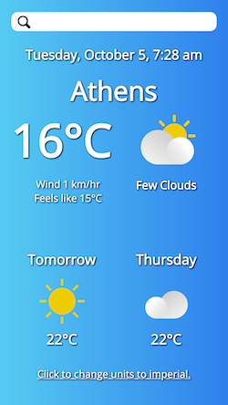
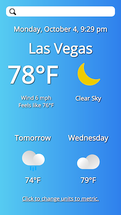

# Weather app project ☀️

&nbsp;&nbsp;&nbsp;

**Optimized for 📱 mobile and&nbsp; 🖥 &nbsp;desktop!**

**See it live at (https://rusty-reebs.github.io/weather-app/)!**  

Date completed: October 3, 2021  

Objectives: use APIs and asynchronous JavaScript for a weather app.  

### Screenshots
-----

&nbsp;

### TIL Things I Learned
-----

- how to fetch data from an API
- how to write asynchronous functions with await
- how to sort through and refine large JSON files
- how to use the JavaScript Date object and methods, including time zone conversion
- how to use CSS media queries