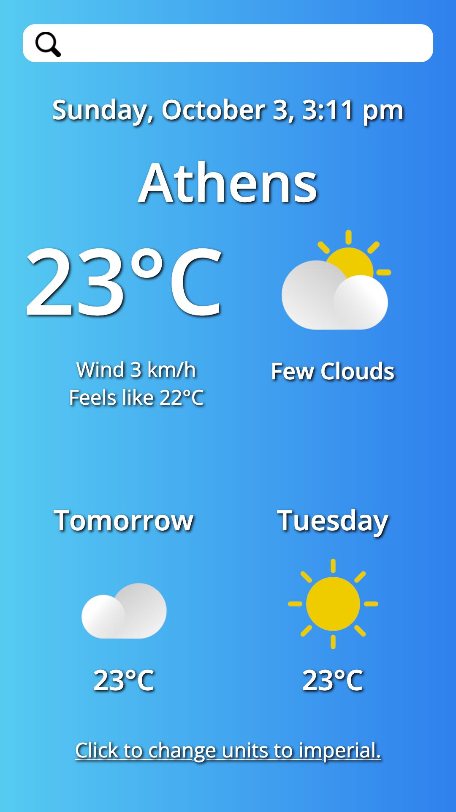

# Weather app project ☀️

**A weather app project coded with HTML, CSS, plain JavaScript, webpack, and APIs.**

**Best viewed on 📱 mobile!**

Date started: September 22, 2021  
Date completed: October 3, 2021  

**Run webpack to create the `index.html` and `main.js` files in `/dist`.**

Objectives: use APIs and asynchronous JavaScript for a weather app.  

### Screenshots
-----

### TIL Things I Learned
-----

- how to fetch data from an API
- how to write asynchronous functions with await
- how to sort through and refine large JSON files
- how to use the JavaScript Date object and methods, including time zone conversion
- how to use CSS media queries